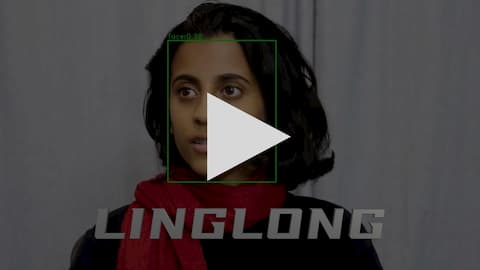

# LINGLONG

A human friendly implementation of deep learning face detection.

Watch this video demo:

[](https://www.bilibili.com/video/BV1s54y167CA/)

## Features
 
 - Advanced model architecture: Fully convolutional ShuffleNet v2
 - Balanced training loss: focal loss
 - Feature pyramid network
 - Data augmentation: randomly scale/flip

## Getting Started

These instructions will get you a copy of the project up and running on your local machine for development and testing purposes.

### Prerequisites


### Installing
#### Get the source code for training

```shell
# From your favorite development directory
git clone --recursive https://github.com/yinguobing/linglong.git
```

#### Generate the training data
Set the path of the raw dataset in `tf_record_generator.py`, then run:

```shell
python3 tf_record_generator.py
```

Currently supported dataset: WIDER-FACE. You can use any dataset record file as long as they have valid fields and values pairs for detection.

## Training

### Set the training and validation datasets

These files do not change frequently so set them in the source code.

```python
# In module `train.py`
# Training data.
record_train = "/path/to/train.record"

# Validation data.
record_val = "/path/to/val.record"
```

### Build the model
Multi-class object detection is supported. Set the variable `num_classes` before building the model.

```python
# In module `train.py`
num_classes = 2
model = build_model(num_classes)
```

### Start training
Set the hyper parameters in the command line.

```Shell
python3 train.py --epochs=80 --batch_size=16
```

Training checkpoints can be found in directory `./checkpoints`. Before training started, this directory will be checked and the model will be restored if any checkpoint is available. Only the best model (smallest validation loss) will be saved.

### Resume training
If training was interrupted, resume it by providing `--initial_epoch` argument.

```bash
python3 train.py --epochs=80 --initial_epoch=61
```

### Monitor the training process
Use TensorBoard. The log and profiling files are in directory `./logs`

```shell
tensorboard --logdir /path/to/linglong/logs

```

Set the variable `log_image` to log detection result of image in TensorBoard.

## Evaluation
A quick evaluation on validation datasets will be performed automatically after training.


## Export
Even though the model wights are saved in the checkpoint, it is better to save the entire model so you won't need the source code to restore it. This is useful for inference and model optimization later.

### For cloud/PC applications
Exported model will be saved in `saved_model` format in directory `./exported`. You can restore the model with `Keras` directly.

```bash
python3 train.py --export_only=True

## Inference
Check out module `predict.py` for inference with video files or webcams.

```bash
python3 predict.py
```

Incase you want to save the processed video file, provide the file path with `--output`.

## Authors
Yin Guobing (尹国冰) - yinguobing


## License


## Acknowledgments

- [Srihari Humbarwadi](https://twitter.com/srihari_rh), for the [original RetinaNet implementation](https://github.com/keras-team/keras-io/blob/master/examples/vision/retinanet.py).